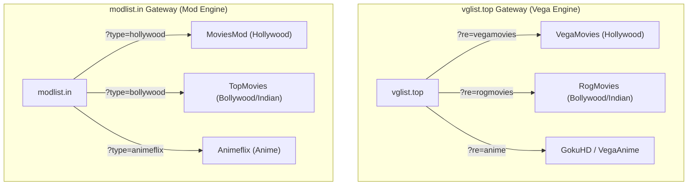

# 🛰️ HoloGram — Developer Handover & System State Document

## 1. Executive Overview
**HoloGram** is an Expo SDK 57 React Native streaming & downloading application with native Android video playback, a 2-layer downloader console, live domain synchronization via GitHub Actions, and an integrated scraper network ported from CloudStream extractors.

---

## 2. Gateway Portals & Scraper Clone Families

The scraping network is organized into two primary mirror gateway families:



### Resolver Architecture & Features:
1. **Vega Family (`vegamoviesResolver.ts`, `rogmoviesResolver.ts`)**:
   * **Movie vs Series Segregation**: Strict classification via title regex to prevent movie buttons (`⚡ G-Direct`, `⚡ V-Cloud`) from being misclassified as web series.
   * **Strict Season Numbers**: Word-bounded `\b(?:Season|S)\s*0*(\d{1,2})\b` to eliminate WordPress upload path artifacts like `S2026`.
   * **NexDrive Episode Unpacking**: Matches section headers `<h4>-:Episodes: X:-</h4>` and direct links, ranking **V-Cloud as Priority #1** over FastDL.
   * **Deep Locker Unlocker**: Decodes double-atob VCloud tokens directly into streaming endpoints.

2. **Mod Family (`moviesmodResolver.ts`, `topmoviesResolver.ts`)**:
   * **Body Isolation**: Restricted parsing to `<div class="thecontent">` / `<div class="entry-content">`, terminating before related posts & comments (eliminating 394 duplicate link artifacts).
   * **ModPro & LeechPro Unpackers**: Handles `episodes.modpro.blog`, `links.modpro.blog`, `episodes.leechpro.blog`, and `links.leechpro.blog`.
   * **CloudStream 2-Step Bypass Engine**: Auto-posts hidden form tokens on `cloud.unblockedgames.world` to unpack destination lockers (**DriveSeed / DriveLeech / FastDL**) directly with zero countdowns/verification.
   * **Batch Zip Support**: Ingests the `All Episodes Batch` button to resolve direct `driveseed.org/list/...` folders.

---

## 3. Downloader Terminal & 2-Layer Console (`DownloaderScreen.tsx`)

### Layer 1: Discovered Posts Feed
* Displays search result cards across all active providers sorted by Fuzzy confidence score.
* Includes a **`[ ↗ PAGE ]`** quick-launch button to open the source post in the browser.

### Layer 2: Quality & Episode Console
* **Always-Visible Return Pill**: `[ ← ALL RESULTS (N) ]` is permanently visible at the top, supported by the Android hardware back button (LIFO).
* **Open Page Button**: `[ ↗ OPEN PAGE ]` in the active banner.
* **Universal Case-Insensitive Quality Chips**: `480p`, `720p`, `1080p`, `2K`, `4K`.
* **3-Column Episode Grid**:
  * **First Button**: Solid **`[ ⚡ HUB ]`** button (automatically resolves and unlocks the parent NexDrive or DriveSeed list folder).
  * **Followed by**: **`[ EP 01 ]`**, **`[ EP 02 ]`**, ... with duplicate key protection (`ep-X-index`).
* **Category Tabs Bar**:
  * **`[ ALL ]`** *(Default)*: Concurrently scrapes VegaMovies + MoviesMod + RogMovies + TopMovies.
  * **`[ HOLLYWOOD ]`**: VegaMovies + MoviesMod.
  * **`[ INDIAN ]`**: RogMovies + TopMovies.
  * **`[ ANIME ]`**: Anime feeds.
  * **`[ ASIAN ]`**: K-Drama / Asian feeds.

---

## 4. Live Domain Synchronization (`tracker.js` & `domains.json`)

* **Dynamic Script Follower**: `tracker.js` fetches `1vegamovies.cc`, extracts the dynamic `href="/?re=vg&t=2"` script parameter, follows the HTTP redirect, and resolves the destination domain dynamically without hardcoding.
* **Current Active Domains (`domains.json`)**:
  ```json
  {
    "vegamovies": "https://new2.vegamovies.futbol",
    "moviesmod": "https://moviesmod.zone",
    "rogmovies": "https://new2.rogmovies.click",
    "topmovies": "https://moviesleech.art",
    "gokuhd": "https://gokuhd.com",
    "animeflix": "https://animeflix.dad",
    "vidsrc": "https://vidsrc2.ru",
    "kickassanime": "https://kaa.lt"
  }
  ```

---

## 5. App-Wide LIFO Hardware Back Stack

* **`AppNavigator.tsx`**: Maintains a `tabHistory` stack. Pressing back pops secondary tabs (`downloader`, `swipe`, `me`) back to `home` before app exit.
* **Component-Level Modals & Layers**: Overlays and sheets (Detail sheets, Trailer modals, Layer 2 console) register their own `BackHandler` listeners that intercept and close overlays first.

---

## 6. Next Steps & Recommended Follow-Ups

1. **Additional Regional Providers**: Connect Animeflix / GokuHD and Asian Drama providers into the new `ANIME` and `ASIAN` tabs.
2. **Offline Download Manager**: Enhance background download tracking in `DatabaseStorage.ts` for native background chunk downloads.
3. **CloudStream Repo Exploration**: Continue leveraging the cloned repositories in `scratch/cloudstream-repos/` for additional niche extractors.
