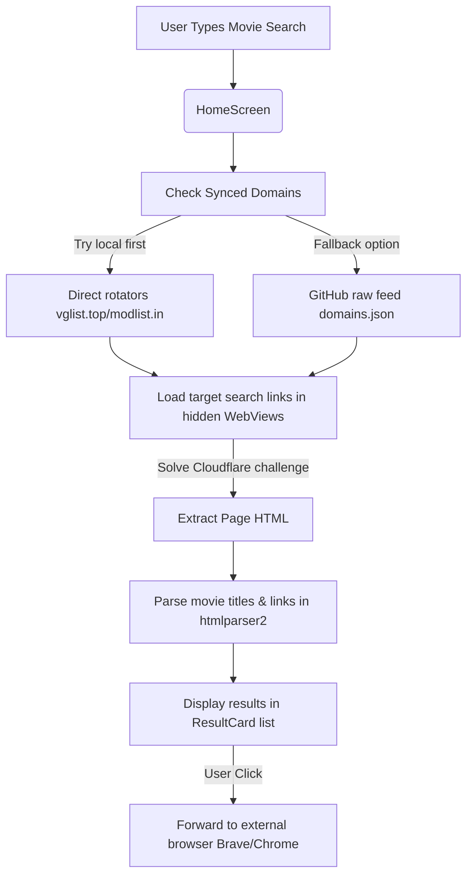

# MoviesHound Mobile App

MoviesHound is a custom-branded, high-performance parallel movie search aggregator built with **React Native + Expo**. It features a design aesthetic combining the retro-industrial monochrome feel of **Nothing OS** with the spacious capsule navigation of **Pixel OS**.

---

## Folder Structure

```text
OWN_APP/
├── .github/
│   └── workflows/
│       └── sync.yml              # GitHub Actions Workflow (Runs tracker twice daily)
├── assets/
│   ├── fonts/                    # Custom NDOT, NType82 and Lettera fonts
│   │   ├── LetteraMonoLL-Regular.otf
│   │   ├── NType82Mono-Regular.otf
│   │   ├── Ndot55-Regular.otf
│   │   └── Ndot57-Regular.otf
│   ├── icon.png                  # App icon (MoviesHound branding)
│   ├── splash-icon.png           # App splash screen icon
│   └── favicon.png               # Web view favicon
├── src/
│   ├── components/               # Custom modular UI components
│   │   ├── CategoryPill.tsx      # Nothing OS capsule tag pills
│   │   └── ResultCard.tsx        # Framed Glassmorphic Search Result card
│   ├── screens/                  # Application screens
│   │   └── HomeScreen.tsx        # Main search, filter & background scrape engine
│   └── utils/                    # Core developer helper utilities
│       ├── parser.ts             # HTML string parser powered by htmlparser2
│       └── resolver.ts           # Redirection Hub resolver (follows HTML meta-refresh tags)
├── App.tsx                       # Root view (font asset loader & screen router)
├── app.json                      # Expo application metadata configuration
├── eas.json                      # EAS Build profile configuration (APK/AAB configurations)
├── package.json                  # NPM packages & SDK version mapping
├── tracker.js                    # Node.js scraper script (executes in GitHub workflow)
└── tsconfig.json                 # TypeScript compiler specifications
```

---

## Architecture & Data Flow



---

## Tech Stack & Configuration

* **Core**: React Native (SDK 51) + Expo (stable, highly compatible with standard Expo Go apps).
* **Styling**: Vanilla React Native StyleSheet with Obsidian Black (`#0A0A0C`), Neon Green (`#00FF88`), and Nothing-Red (`#FF2D55`) color accents.
* **Scraper**: Hidden off-screen `WebView` instances running parallel queries to solve Cloudflare checks client-side without any server costs.
* **Redirection Resolvers**: Follows HTML-level `<meta http-equiv="refresh" ...>` tags of major hub directories automatically.

---

## Build & Testing Pipeline

### 1. Local Development Check
Start the Metro server:
```cmd
npx expo start
```
Connect your phone and computer to the same hotspot, open **Expo Go**, select **"Enter URL manually"** and enter:
```text
exp://localhost:8081
```

### 2. Domain Auto-Updater Setup (GitHub Actions)
Push the code to your GitHub repository:
```cmd
git init
git add .
git commit -m "feat: initial commit"
git branch -M main
git remote add origin YOUR_REPO_URL
git push -u origin main
```
*The Actions cron workflow `.github/workflows/sync.yml` will automatically execute `tracker.js` twice a day and keep your `domains.json` up to date.*

### 3. Generate Standalone APK (EAS Cloud)
To compile a direct, standalone `.apk` installer without using Expo Go:
1. Install EAS CLI: `npm install -g eas-cli`
2. Create account/login: `eas login`
3. Execute compile: `eas build --platform android --profile preview`
