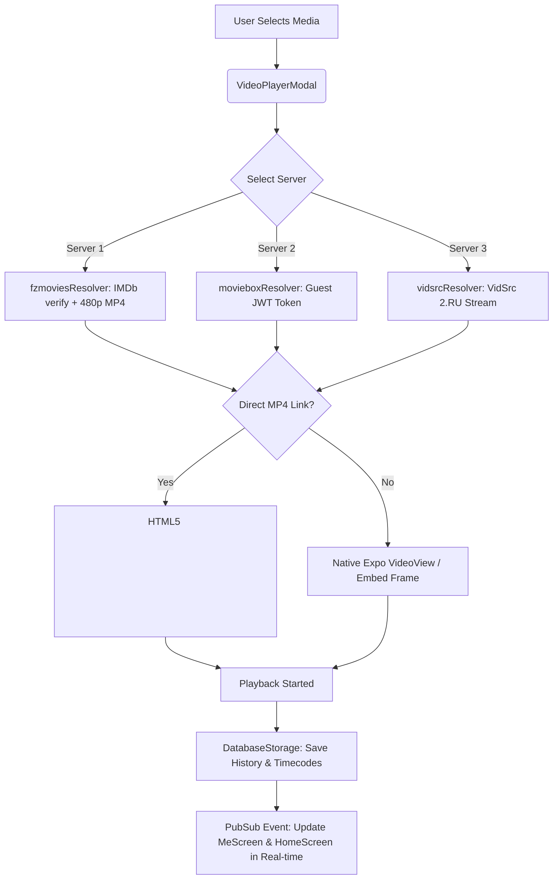

# HoloGram 🎬

**HoloGram** is a next-generation, high-performance streaming aggregator and offline-first media hub built with **React Native + Expo (SDK 54)**. It features a retro-futuristic industrial design aesthetic combining the typography of **Nothing OS** with the spacious capsule navigation of **Pixel OS**.

---

## ✨ Key Features

* 🚀 **Reverse-Engineered Streaming Engines**:
  * **Server 1 (`FAST 480P MP4`)**: FzMovies 5-step reverse-engineered scraper engine featuring IMDb cross-verification (`ttXXXXXXX`), 480p MP4 filtering, and max-connection CDN mirror selection.
  * **Server 2 (`MOVIEBOX MP4`)**: MovieBox guest JWT token resolver.
  * **Server 3 (`VIDSRC 2.RU`)**: VidSrc direct stream resolver.
  * **Embed Fallbacks**: MultiEmbed and SuperEmbed HTML5 players with ad-blocking injection.

* 🗄️ **Unified Local Database Engine (`DatabaseStorage.ts`)**:
  * **Brand-Agnostic Storage**: Clean keys (`@watchlist`, `@watched_list`, `@liked_list`, `@loved_list`, `@disliked_list`, `@watch_history`, `@cached_feeds`).
  * **Real-time PubSub Sync**: Live cross-screen synchronization (`subscribeStorageChanges`) between `HomeScreen`, `SwipeCard`, and `MeScreen`.
  * **Memory Write-Through Buffer**: Immediate memory updates (< 1ms UI reactivity) paired with asynchronous disk persistence.
  * **Mutual Exclusion**: Adding an item to `LIKED` or `LOVED` automatically removes it from `DISLIKED` (and vice-versa).
  * **Legacy Key Migration**: Automatic 1-step migration on cold launch.

* ⚡ **Stale-While-Revalidate Catalog Feed Caching (`ContentCache.ts`)**:
  * Home feeds (`forYou`, `trendingHollywood`, `trendingTV`, `bollywood`, `trendingAnime`) load **instantly (< 50ms)** on startup from local cache, while revalidating fresh TMDB/AniList data silently in the background.

* 🎥 **Dual Native & HTML5 Video Engine**:
  * Powered by Expo `VideoView` and an embedded HTML5 `<video type="video/mp4">` player container to decode progressive MP4 byte streams regardless of server `application/octet-stream` MIME headers.

* 📦 **One-Click JSON Database Backup & Restore**:
  * Export single-file physical `.json` backups (`hologram_backup_YYYY-MM-DD.json`) or restore from files/clipboards with instant UI updates (`flushMemoryBufferAndNotify`).

* ⚙️ **Automated CI/CD Workflows**:
  * **Domain Sync (`sync.yml`)**: GitHub Actions runner auto-updates mirror rotators (`domains.json`) on Node 22.
  * **APK Build Pipeline (`build-apk.yml`)**: One-click GitHub Action for building standalone Debug/Release Android APKs.

---

## 📁 Repository Structure

```text
HoloGram/
├── .github/
│   └── workflows/
│       ├── build-apk.yml         # GitHub Actions standalone Android APK compiler
│       └── sync.yml              # GitHub Actions automated mirror domain rotator
├── assets/
│   ├── fonts/                    # Custom NDOT, NType82 and Lettera fonts
│   │   ├── LetteraMonoLL-Regular.otf
│   │   ├── NType82Mono-Regular.otf
│   │   ├── Ndot55-Regular.otf
│   │   └── Ndot57-Regular.otf
│   ├── icon.png                  # App icon
│   └── splash-icon.png           # Splash screen asset
├── src/
│   ├── components/               # Modular UI components
│   │   ├── CategoryPill.tsx      # Nothing OS capsule tag pills
│   │   ├── FilterDrawerModal.tsx # Discover & Filter Drawer modal
│   │   ├── ResultCard.tsx        # Glassmorphic search result cards
│   │   ├── SwipeCard.tsx         # Movie Tinder interactive swipe cards
│   │   └── VideoPlayerModal.tsx  # Dual Native/HTML5 streaming modal
│   ├── screens/                  # Primary App Screens
│   │   ├── DownloaderScreen.tsx  # Scraper terminal downloader
│   │   ├── HomeScreen.tsx        # Discovery feeds & search engine
│   │   └── MeScreen.tsx          # 5-List manager, history & settings
│   └── utils/                    # Core Developer Helper Utilities
│       ├── DatabaseBackup.ts     # JSON export & restore engine
│       ├── DatabaseStorage.ts    # Unified local database & PubSub listener
│       ├── ContentCache.ts       # Stale-While-Revalidate feed cache
│       ├── TasteEngine.ts        # AI taste profile & recommendation ranker
│       ├── fzmoviesResolver.ts   # FzMovies reverse-engineered scraper
│       ├── movieboxResolver.ts   # MovieBox API stream resolver
│       ├── streamResolver.ts     # Multi-server fallback engine
│       ├── tmdb.ts               # TMDB API & Indian ISP proxy wrapper
│       └── resolver.ts           # Mirror domain rotator hub
├── App.tsx                       # App entry point & root navigation
├── app.json                      # Expo metadata configuration
└── package.json                  # Dependencies & scripts
```

---

## 🔄 Architecture & Data Flow


```mermaid
graph TD
    A[User Selects Media] --> B(VideoPlayerModal)
    B --> C{Select Server}
    C -->|Server 1| D[fzmoviesResolver: IMDb verify + 480p MP4]
    C -->|Server 2| E[movieboxResolver: Guest JWT Token]
    C -->|Server 3| F[vidsrcResolver: VidSrc 2.RU Stream]
    D & E & F --> G{Direct MP4 Link?}
    G -->|Yes| H[HTML5 <video type='video/mp4'> WebView Container]
    G -->|No| I[Native Expo VideoView / Embed Frame]
    H & I --> J[Playback Started]
    J --> K[DatabaseStorage: Save History & Timecodes]
    K --> L[PubSub Event: Update MeScreen & HomeScreen in Real-time]
```

---

## 🛠️ Development & Build Setup

### 1. Run Locally (Metro Bundler)
```bash
# Install dependencies
npm install

# Start Metro Bundler
npx expo start
```

### 2. USB Debugging with Dev Client
```bash
npm run dev
```
*(Runs `adb reverse tcp:8081 tcp:8081` and launches Metro in dev-client mode)*

### 3. Generate Standalone Android APK via GitHub Actions
1. Go to your GitHub Repository $\rightarrow$ **Actions**.
2. Select **Build Android APK** $\rightarrow$ Click **Run workflow**.
3. Choose `release` or `debug` $\rightarrow$ Download your `.apk` artifact directly from GitHub!
