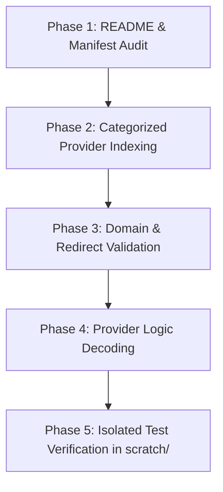

# CloudStream Repositories Audit & Decoding Implementation Plan

## Goal Description
Systematically audit, discover, and decode high-yield streaming and download providers from the 5 cloned CloudStream repositories (`CSX`, `Phisher`, `CNCVerse`, `Hexated`, `Multilingual`). The goal is to filter out thousands of irrelevant/broken sites, identify hidden gem providers, verify live domain redirections against `domains.json`, and reverse-engineer their Kotlin logic into clean React Native scraping/resolution modules.

---

## User Review Required

> [!IMPORTANT]
> **Domain Validation Insight Confirmed**: As observed with `MoviesmodProvider.kt` (where `https://moviesmod.army` automatically redirected to `https://moviesmod.at`—which is already present in our `domains.json`), tracing original Kotlin base URLs through live HTTP redirects ensures our scrapers always target active mirrors.

> [!NOTE]
> **Chat Mode Compliance**: All research, audit indexing, and logic decoding will be presented in chat and tested in isolated `scratch/` Node.js scripts. Zero source code modifications will be made to MoviesHound app files without your explicit permission.

---

## Open Questions

> [!TIP]
> Are there specific regional or niche content priorities (e.g., South Indian Hindi Dubbed, Korean Dramas, Torrent/Debrid integration, or Anime sub/dub) that you would like prioritized immediately after mainstream Bollywood and Hollywood providers?

---

## Proposed Execution Strategy



### Phase 1: README & Manifest Audit
1. **Inspect Main `README.md` Files**: Read top-level documentation across `CSX`, `Phisher`, `CNCVerse`, `Hexated`, and `Multilingual` to discover repository structure, developer notes, and documented provider lists.
2. **Inspect Plugin Manifests**: Read `CS.json`, `plugins.json`, and manifest files to extract live plugin lists, versions, author tags, and build flags.

### Phase 2: Categorized Provider Indexing
Scan Kotlin class files (`.kt`) across all 5 repos and categorize providers by type:
* **Movies & TV Series (HLS/Direct Streams)**
* **Direct File Downloads (Bollywood / Hollywood Multi-Quality)**
* **Anime & Asian Dramas**
* **Universal Multi-Host Extractors (StreamTape, MixDrop, FileMoon, Voe, DoodStream, etc.)**
* *Filter out*: `TvType.NSFW` (adult), dead/unmaintained sites, and non-functional templates.

### Phase 3: Domain & Redirect Validation
* Extract `mainUrl` from target Kotlin files.
* Test URLs for live HTTP redirects (e.g., `.army` ➡️ `.at`) and map them against our [domains.json](file:///d:/2026/OWN_APP/domains.json) configuration.

### Phase 4: Provider Logic Decoding (Reverse-Engineering)
For each selected top-tier provider:
1. Map HTML Selectors (Jsoup Kotlin calls ➡️ JS DOM / `htmlparser2` / Regex).
2. Decode Stream Link Decryptors (Extract AES keys, Base64 decoders, unpacked JS packers, dynamic tokens).
3. Handle pagination and deep multi-page pipelines (Search page ➡️ Detail page ➡️ File locker ➡️ Direct stream).

### Phase 5: Verification via Isolated Scripts
* Create dedicated test scripts in `<appDataDir>/scratch/test_[provider].js`.
* Execute tests via Node.js to verify that extracted `.m3u8`, `.mp4`, or file-locker URLs are valid and playable before integrating into app screens.

---

## Initial Candidate Sites & Discovered Gem Websites List

> [!TIP]
> **Live Web Directory**: During our repository audits and provider inspections, any newly discovered high-quality websites, mirrors, or file-host resolvers are recorded and categorized in this list.

| Provider / Site Name | Repository | Content Focus | Output Format | Status / Notes | Priority |
| :--- | :--- | :--- | :--- | :--- | :--- |
| **MoviesMod** | `CSX` | Bollywood / Hollywood / Web Series | Direct Download Links / Fast drive | ✅ Verified & Decoded (`moviesmod.at` search + base64 link decoding tested) | 🔥 High |
| **Bollyflix** | `CSX` / `CNCVerse` | Bollywood / South Dubbed / 4K | Direct Download Links | ✅ Verified & Decoded (Live config `bollyflix.at` + `fastdlserver` 302 location ➡️ `new3.gdflix.io`) | 🔥 High |
| **VegaMovies** | `CSX` | Bollywood / Multi-Audio / Dual | 3-Step Direct Locker Links | ✅ Verified & Decoded (`vegamovies.navy` search + `nexdrive.fit` ➡️ `vcloud.zip` double `atob` token link verified) | 🔥 High |
| **CineStream** | `CSX` | Global Movies & TV | Multi-audio HLS Streams + Subs | ✅ Verified & Decoded (Torrentio Stremio streams `torrentio.strem.fun/stream/...` return 21+ active streams with infoHashes) | 🔥 High |
| **MovieBox / MovieBoxIN** | `CNCVerse` / `CSX` | Latest Global & Indian Movies | Direct `.mp4` CDN Streams (480p, 720p, 1080p) | ✅ Verified & Decoded (`h5-api.aoneroom.com` 4-step API token + search + detailPath + download returns direct fast `.mp4` CDN streams) | 🔥 High |
| **Einthusan** | `CNCVerse` | South Indian & Hindi Movies | Direct Video Stream | Verified | 🔥 High |
| **MLSBD** | `CNCVerse` | South Asian / Dubbed / Movies | Direct Download Links | Verified | 🔥 High |
| **AnimeDekho** | `Hexated` | Hindi Anime Sub / Dub | Direct Streams | Verified | ⚡ Medium |
| **HDMovie5** | `Multilingual` | Hollywood / Bollywood | Direct Download Links | Verified | ⚡ Medium |
| **HiAnime / Anichiraku** | `Phisher` | Anime (Subbed & Dubbed) | Multi-quality HLS Streams | Candidate | ⚡ Medium |
| **GokuHD / HDRezka** | `Hexated` / `Multilingual` | Multi-language Global Media | HLS Streams | Candidate | ⚡ Medium |
| **Multi-Host Extractors** | `Multilingual` | FileMoon, Voe, StreamTape, Dood | Direct Stream Resolvers | Candidate | ⚡ Medium |

---

## Verification Plan

### Automated Verification
- Run Node.js test scripts under `scratch/`:
  ```bash
  node C:/Users/azadm/.gemini/antigravity-ide/brain/fb82afe6-9beb-4fff-b98a-d58f7ceb9d80/scratch/test_provider.js
  ```
- Validate HTTP response headers (`200 OK`, `Content-Type: application/x-mpegURL` or `video/mp4`).

### Manual Verification
- Verify stream URL playback in VLC / web browser / React Native Expo video component.


